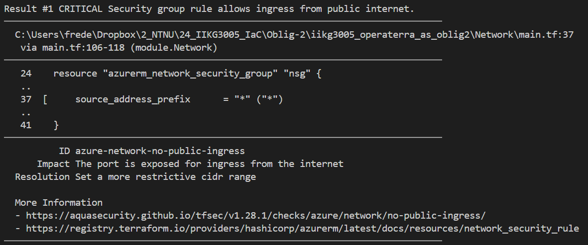
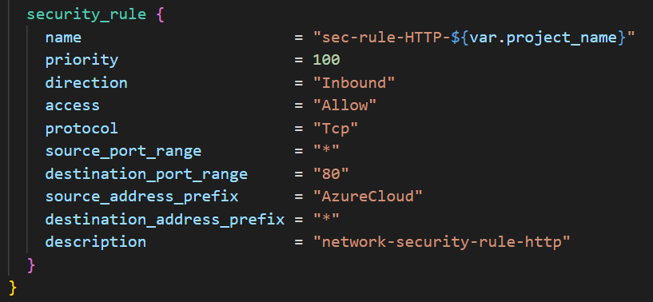
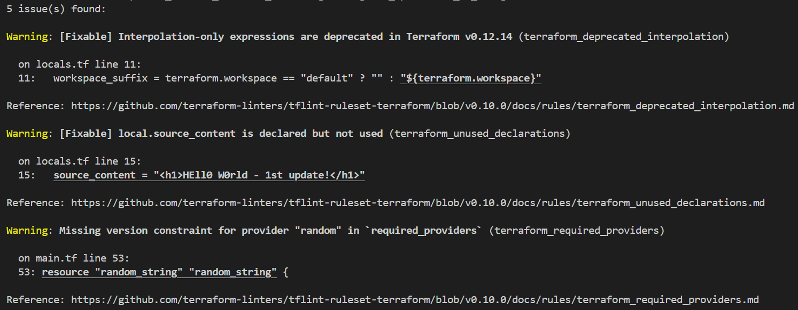
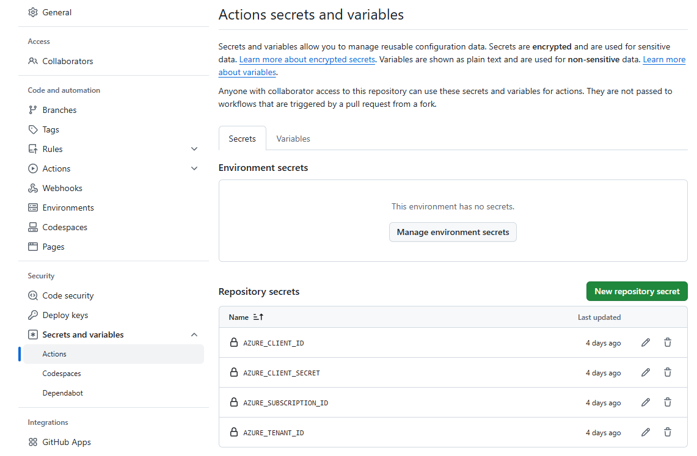
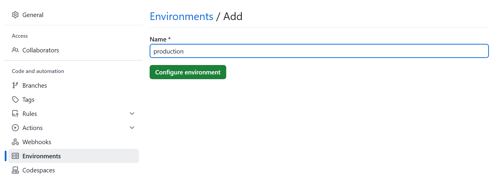
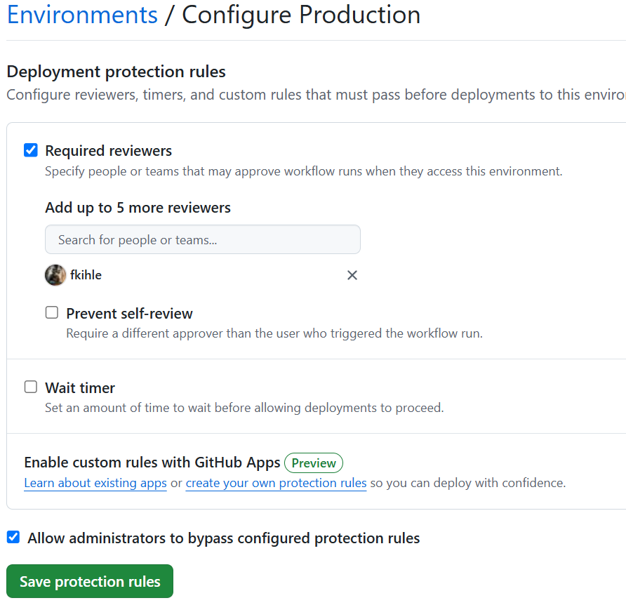
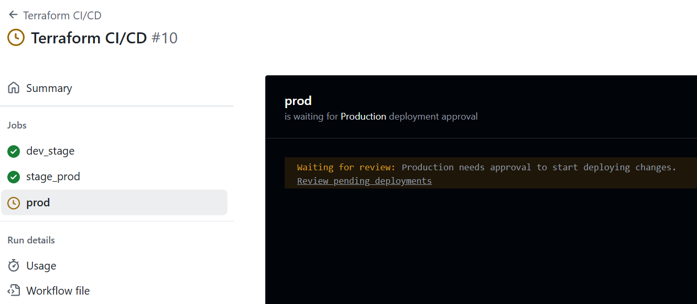
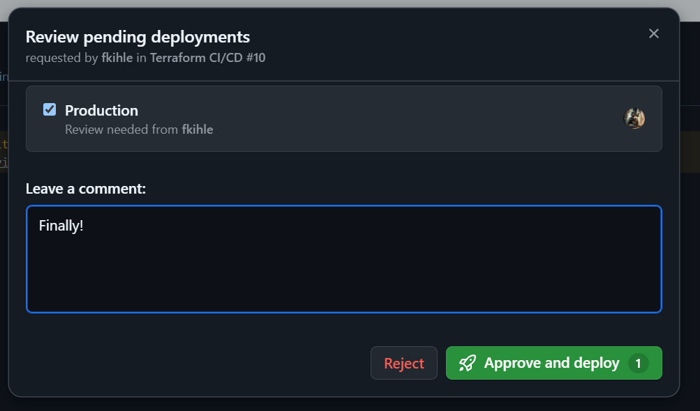
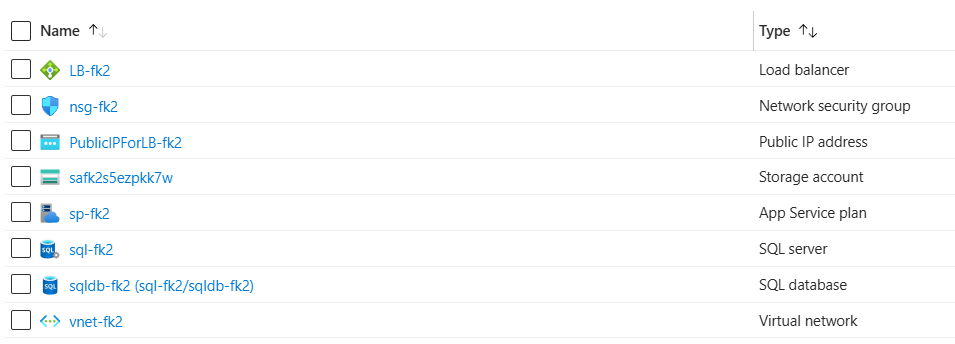
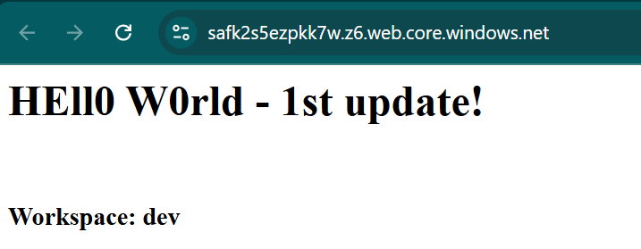

# Infrastructure as Code - Oblig 2

## Overview
- Project structure and module descriptions
- The use of terraform scripts
- Working in Terraform Workspaces
- Prerequisites/Dependencies
- Images from testing and deployment


## Project structure and module descriptions
The project is structured as follows:

```
iikg3005_operaterra_as_oblig2/
│
├── backend/
|   ├── main.tf
|   ├── providers.tf
|   ├── variables.tf
|   └── terraform.tfvars
|
├── modules/
│   ├── Database/
|   |   ├── main.tf
|   |   ├── output.tf
|   |   └── variables.tf
│   ├── LoadBalancer/
|   |   ├── main.tf
|   |   ├── output.tf
|   |   └── variables.tf
│   ├── Network/
|   |   ├── main.tf
|   |   ├── output.tf
|   |   └── variables.tf
│   └── Storage/
|       ├── main.tf
|       ├── output.tf
|       └── variables.tf
│
├── locals.tf
├── main.tf
├── providers.tf
├── terraform.tfvars
└── variables.tf
│
└── README.md
```

The project consist of a root folder where the main terraform files are located, this includes a main.tf file containing the terraform code for connecting the modules used in the project and the rest of the .tf files are self-explainatory from their filename. The terraform.tfvars file contains example values for the more sensistive variables such at the subscription id. This id has been manually entered into github secrets for use with github workflows. The .gitignore file contains files that should be excluded from being pushed to github.

The modules in this project are responsible for provisioning the infrastructure resources in Azure:
- Database
- LoadBalancer
- Network
- Storage

### Database module
The database module is responsible for provisioning the database resources in Azure. This includes a resource group, an Azure SQL Database, and a SQL Server. The SQL Server was supposed to be configured with a firewall rule to allow access from a specific IP address. Didn't get that to work so the code is commented out.

### LoadBalancer module
The LoadBalancer module is responsible for provisioning the load balancer resources in Azure. The module sets up a static, standard SKU public IP address and associates it with the load balancer's frontend configuration. Didn't get it to successfully connect it's frontend to the backend responsible for the static website. So, in essence, this load balancer is just floating in space and balancing absolutely nothing. 

### Network module
The Network module is responsible for provisioning the network infrastructure in Azure. This includes creating a virtual network (VNET) with a specified address space, and multiple subnets within that VNET. Each subnet is assigned an address range and is associated with a Network Security Group (NSG) to control inbound traffic. The NSG includes a security rule to allow HTTP traffic on port 80 from AzureCloud (after suggestion from tfsec, changed from "*"). The subnets are then associated with the NSG to enforce the security rules.

### Storage module
The Storage module is responsible for provisioning the storage resources in Azure. This includes creating a storage account with a globally redundant storage (GRS) replication type and a minimum TLS version of 1.2 for enhanced security. The storage account is configured to host a static website, with the index document specified by a variable. Additionally, the module provisions a blob storage resource within the storage account to store the website's index HTML file. The blob storage is configured with the appropriate content type and includes dynamic content that displays the current Terraform workspace. For some reason the blob keeps locking and the whole project needs a manual tearing down before trying again.


## The use of terraform scripts
Terraform scripts used in to provision the infrastructure:

### Initialize Terraform
Initialize a terraform project:
```
terraform init
```
### Terraform format
Fix the formatting of the terraform files:
```
terraform fmt -recursive
```
### Terraform validate
Check if the terraform files work together locally:
```
terraform validate
```
### TFSEC
Installation:  
*Run powershell as Administrator*
```powershell
choco install tfsec
```
Check for security issues:
```
tfsec --minimum-severity HIGH
```
*The minimum severity tells the program to skip warnings that are below HIGH in severity.*
### TFLINT
Installation:  
*Run powershell as Administrator*
```powershell
choco install tflint
```
Perform code linting:
```
tflint --init && tflint
```
### Terraform plan
Create a plan file and get a preview of what terraform will do:
```
terraform plan -out=main.tfplan
```
### Terraform apply
Apply the infrastructure from the plan file (aka Go Live):
```
terraform apply "main.tfplan"
```
To deploy directly without a plan file by using this command (useful for Github Workflow):
```
terraform apply -auto-approve
```
### Terraform destroy
Tear the infrastructure down:
```
terraform destroy -auto-approve
```


## Working in Terraform Workspaces

### Create workspaces: dev, stage & prod.  
```hsl
terraform workspace new dev
terraform workspace new stage
terraform workspace new prod
```
### Select workspace
```hsl
terraform workspace select dev
terraform workspace select stage
terraform workspace select prod
```
### Show which workspace you are in
```hsl
terraform workspace show
```
### Show all workspaces
```hsl
terraform workspace list
```


## Prerequisites/Dependencies

- **Terraform** - For provisioning the infrastructure
- **Azure account** - To deploy the infrastructure to
- **Azure CLI** - Authenticating with Azure
- **Github account** - For CI/CD (github actions/workflows) and version control
- **Terraform providers** - hashicorp/azurerm, hashicorp/random


## Images from testing and deployment
This section will show some images of the testing and deployment phase.

#### Terraform workspace listing


#### Terraform tfsec

#### Terraform tfsec fix
Clicking the top link takes you to the file for fixing.



#### Terraform tflint
Useful for finding declared but unused variables and getting best-practice coding suggestions.



#### Where to put the secrets in github



#### Create an environment in github



#### Require review before publishing a pull request
This doesn't work if the repo is "private"



#### Successful workflow waiting for reviewer



#### Reviewer happy that the workflow FINALLY worked



#### Successful deployment
Azure has got stuff in it



#### Static website
Going to the url to see if the static website is up
